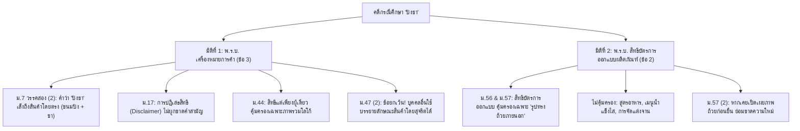

# 🍧 เก็งข้อสอบ & เจาะลึกวิเคราะห์คดี "ปังชา" (Pang Cha Case Study)
> **วิชา:** กฎหมายทรัพย์สินทางปัญญา (Intellectual Property Law)  
> **อาจารย์ผู้สอน:** อ.ชูติกานต์ ช่วยแท่น | คณะนิติศาสตร์  
> **อ้างอิง:** คำบรรยายและสไลด์จาก `Doc/ข้อมูลหลัก` (เครื่องหมายการค้า + สิทธิบัตรการออกแบบ)

---

## 🎯 ภาพรวมข้อเท็จจริงคดี "ปังชา" (Fact Summary)

ร้านขนมหวานชื่อดังแห่งหนึ่ง ได้รับจดทะเบียนเครื่องหมายการค้าและสิทธิบัตรการออกแบบผลิตภัณฑ์ ต่อมาได้ออกหนังสือเตือน (Cease & Desist Letter) ไปยังร้านค้ารายย่อยและร้านอาหารต่าง ๆ ที่ใช้คำว่า **"ปังชา"** หรือใช้ถ้วยเสิร์ฟน้ำแข็งไส โดยเรียกร้องค่าเสียหายหลักล้านถึงร้อยล้านบาท และสั่งห้ามมิให้ใช้คำว่า "ปังชา" อีกต่อไป

---

## 🧭 การวิเคราะห์ใน 2 มิติทางกฎหมายทรัพย์สินทางปัญญา

---

## 📝 ข้อสอบเก็งตุ๊กตา คดี "ปังชา" (Exam Scenario)

### 📌 โจทย์ตุ๊กตา:
> **บริษัท ลูกทอง จำกัด** ได้รับจดทะเบียนเครื่องหมายการค้าภาพโลโก้ที่มีรูปถ้วยขนมและมีข้อความภาษาไทยว่า **"ปังชา ชาไทยเย็น"** สำหรับสินค้าขนมหวานและเครื่องดื่ม และบริษัทฯ ยังได้รับจดทะเบียนสิทธิบัตรการออกแบบผลิตภัณฑ์ **"ถ้วยแก้วใส่ขนมหวานทรงกลมมีขอบหยัก"** 
> 
> ต่อมา บริษัทฯ พบว่า **นายสมชาย** เปิดร้านขายน้ำแข็งไสราดชาไทยและขนมปัง โดยติดป้ายหน้าร้านว่า *"จำหน่าย ปังชา น้ำแข็งไสชาไทยโบราณ"* และเสิร์ฟในถ้วยแก้วธรรมดาทั่วไป บริษัท ลูกทอง จำกัด จึงมอบหมายให้ทนายความส่งหนังสือเตือนไปยังนายสมชาย โดยอ้างว่า:
> 1. นายสมชายละเมิดเครื่องหมายการค้าคำว่า "ปังชา" ตาม ม.44 และเรียกค่าเสียหาย 500,000 บาท
> 2. นายสมชายละเมิดสิทธิบัตรการออกแบบผลิตภัณฑ์เมนูน้ำแข็งไสปังชาของบริษัท
> 
> **คำถาม:** ให้ท่านวินิจฉัยว่า ข้ออ้างทั้ง 2 ประการของ บริษัท ลูกทอง จำกัด ฟังขึ้นหรือไม่? และนายสมชายมีความรับผิดตามกฎหมายหรือไม่?

---

## ⚖️ แนวคำตอบและวิเคราะห์ตามสูตร 3 สเต็ป (IRAC Formula)

### 1. ข้อกฎหมายที่เกี่ยวข้อง
* **พ.ร.บ. เครื่องหมายการค้า พ.ศ. 2534:**
  * **มาตรา 7 วรรคสอง (2):** คำหรือข้อความอันเล็งถึงลักษณะหรือคุณสมบัติของสินค้านั้นโดยตรง ย่อมไม่มีลักษณะบ่งเฉพาะ
  * **มาตรา 17:** คำสั่งปฏิเสธสิทธิในคำสามัญ (Disclaimer)
  * **มาตรา 44:** สิทธิแต่เพียงผู้เดียวของเจ้าของเครื่องหมายการค้าที่จดทะเบียนแล้ว
  * **มาตรา 47 (2):** การจดทะเบียนไม่กระทบต่อสิทธิของบุคคลอื่นที่จะใช้โดยสุจริตซึ่งข้อความบรรยายลักษณะหรือคุณสมบัติของสินค้าของตน
* **พ.ร.บ. สิทธิบัตร พ.ศ. 2522 (แก้ไขเพิ่มเติม):**
  * **มาตรา 3:** นิยามแบบผลิตภัณฑ์ (รูปร่าง ลวดลาย สีสันภายนอก)
  * **มาตรา 56 ประกอบมาตรา 63:** สิทธิบัตรการออกแบบผลิตภัณฑ์คุ้มครองเฉพาะรูปทรงภายนอกของผลิตภัณฑ์ที่จดทะเบียนไว้

---

### 2. วินิจฉัยข้อเท็จจริงปรับบทกฎหมาย

#### 🔹 ประเด็นที่ 1: ข้ออ้างเรื่องการละเมิดเครื่องหมายการค้าคำว่า "ปังชา"
1. คำว่า **"ปังชา"** เกิดจากการรวมกันของคำว่า *"ปัง"* (ขนมปัง) และ *"ชา"* (เครื่องดื่มชา) ซึ่งเป็น **"คำสามัญในการค้า (Generic Term)"** และเป็นคำที่เล็งถึงลักษณะ ส่วนประกอบ หรือคุณสมบัติของสินค้าน้ำแข็งไสใส่ขนมปังและชาไทยโดยตรง ย่อม **ไม่มีลักษณะบ่งเฉพาะในตัวเองตามมาตรา 7 วรรคสอง (2)**
2. การที่นายทะเบียนรับจดทะเบียนเครื่องหมายการค้าให้แก่ บริษัท ลูกทอง จำกัด ย่อมเป็นการรับจดทะเบียนในภาพรวมขององค์ประกอบโลโก้ทั้งหมด และมีการ **ปฏิเสธสิทธิ (Disclaimer) ในคำว่า "ปังชา" ตามมาตรา 17** เพื่อมิให้บุคคลใดบุคคลหนึ่งผูกขาดคำสามัญดังกล่าว
3. แม้ บริษัทฯ จะเป็นเจ้าของเครื่องหมายการค้าตาม **มาตรา 44** แต่ตาม **มาตรา 47 (2)** บัญญัติเป็นข้อยกเว้นว่า *การจดทะเบียนเครื่องหมายการค้าไม่ตัดสิทธิของบุคคลอื่นที่จะใช้โดยสุจริตซึ่งข้อความบรรยายลักษณะหรือคุณสมบัติของสินค้าของตน*
4. การที่นายสมชายใช้คำว่า *"ปังชา"* บนป้ายหน้าร้าน เป็นการใช้เพื่อบรรยายถึงลักษณะของสินค้า (น้ำแข็งไสราดชาไทยใส่ขนมปัง) ของตนโดยสุจริตตามความเป็นจริง มิได้เป็นการลอกเลียนภาพโลโก้หรือลวงขายให้ประชาชนเข้าใจผิดว่าเป็นร้านของบริษัทฯ นายสมชายจึง **ไม่ละเมิดเครื่องหมายการค้าของ บริษัท ลูกทอง จำกัด**

---

#### 🔹 ประเด็นที่ 2: ข้ออ้างเรื่องการละเมิดสิทธิบัตรการออกแบบผลิตภัณฑ์
1. ตาม **มาตรา 3 และมาตรา 56** สิทธิบัตรการออกแบบผลิตภัณฑ์ ให้ความคุ้มครองเฉพาะ **"รูปร่าง ลวดลาย หรือสีสันภายนอกของผลิตภัณฑ์"** (ในที่นี้คือ ถ้วยแก้วทรงกลมมีขอบหยัก)
2. สิทธิบัตรการออกแบบผลิตภัณฑ์ **มิได้ให้ความคุ้มครองถึงตัวเมนูอาหาร, สูตรการทำน้ำแข็งไส, ส่วนผสม หรือวิธีการจัดเสิร์ฟขนมปังราดชาไทย** แต่อย่างใด
3. เมื่อข้อเท็จจริงปรากฏว่า นายสมชายเสิร์ฟน้ำแข็งไสใน **"ถ้วยแก้วธรรมดาทั่วไป"** ซึ่งไม่ได้มีรูปทรง ลวดลาย หรือลักษณะพิเศษที่เหมือนหรือคล้ายกับถ้วยแก้วตามสิทธิบัตรการออกแบบของบริษัทฯ การกระทำของนายสมชายจึง **ไม่เป็นการละเมิดสิทธิบัตรการออกแบบผลิตภัณฑ์ตามมาตรา 63**

---

### 3. สรุปฟันธง (Conclusion)
1. **ข้ออ้างประการที่ 1 ของ บริษัท ลูกทอง จำกัด ฟังไม่ขึ้น:** เพราะคำว่า "ปังชา" เป็นคำสามัญที่ถูกปฏิเสธสิทธิ (ม.17) และนายสมชายมีสิทธิใช้บรรยายสินค้าโดยสุจริตตาม **ม.47 (2)**
2. **ข้ออ้างประการที่ 2 ของ บริษัท ลูกทอง จำกัด ฟังไม่ขึ้น:** เพราะสิทธิบัตรการออกแบบคุ้มครองเฉพาะรูปทรงถ้วยแก้ว มิได้คุ้มครองเมนูอาหาร และนายสมชายใช้ถ้วยแก้วธรรมดาทั่วไป จึงไม่ละเมิดสิทธิบัตรตาม **ม.56 ประกอบ ม.63**
3. **สรุป:** นายสมชายไม่มีความรับผิดตามกฎหมาย และไม่ต้องชดใช้ค่าเสียหายใด ๆ ให้แก่ บริษัท ลูกทอง จำกัด

---

## 💡 สรุปสูตรจำสั้นสำหรับห้องสอบ: "กรณีปังชา"

| หัวข้อ | หลักกฎหมาย | ผลลัพธ์ / ธงคำตอบ |
|---|---|---|
| **คำว่า "ปังชา"** | ม.7 (2) + ม.17 + ม.47 (2) | เป็นคำสามัญ เล็งถึงสินค้า ปฏิเสธสิทธิ $\rightarrow$ คนอื่นใช้บรรยายสินค้าโดยสุจริตได้ ไม่ละเมิด |
| **สิทธิในโลโก้** | ม.44 | คุ้มครองเฉพาะ "ภาพรวมโลโก้และฟอนต์ประดิษฐ์" |
| **ถ้วย/ภาชนะ** | ม.56, 57, 63 | คุ้มครองเฉพาะ "รูปทรงถ้วย" $\rightarrow$ ไม่คุ้มครองเมนู/สูตรอาหาร/ท็อปปิ้ง |
