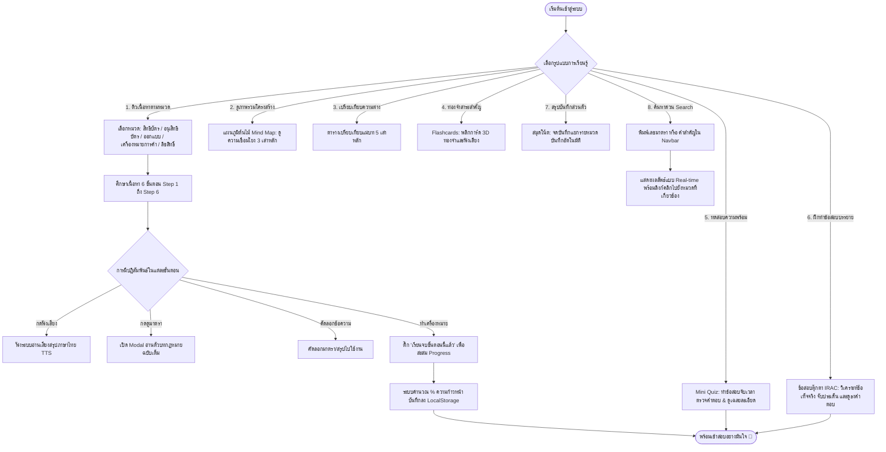
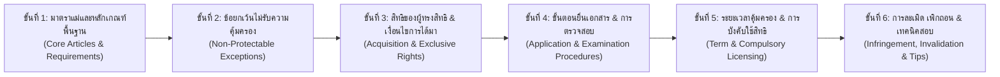
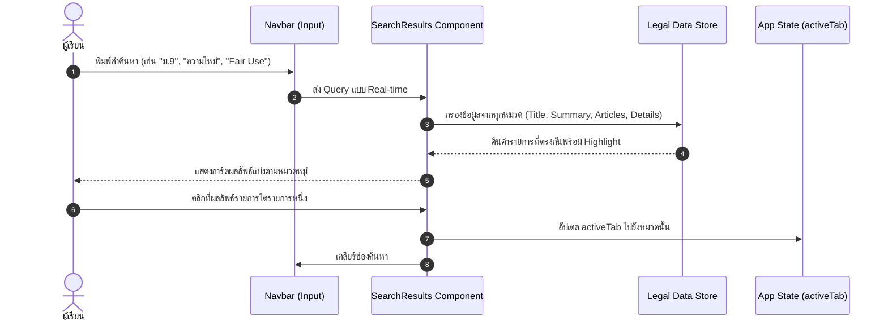
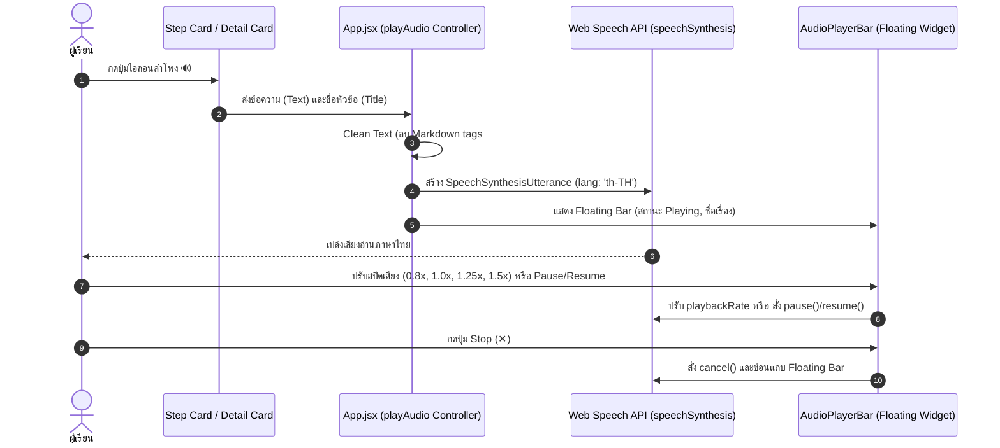
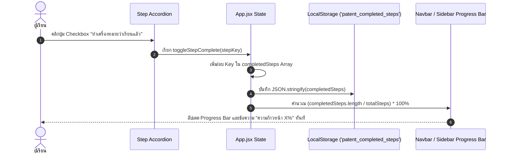
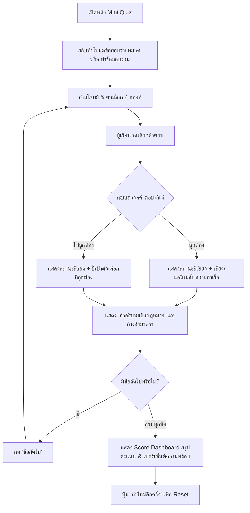
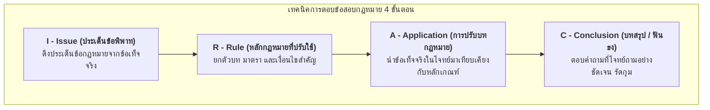
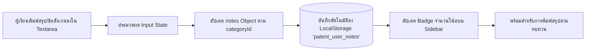

# โฟลว์การทำงานของระบบเว็บติวสอบกฎหมายทรัพย์สินทางปัญญา
## (Interactive Thai IP Law Exam Preparation Dashboard Workflow)

เอกสารนี้รวบรวม **โฟลว์การทำงานทั้งหมด (System & User Workflow)** ของเว็บแอปพลิเคชันสำหรับติวและเตรียมสอบกฎหมายทรัพย์สินทางปัญญา (พ.ร.บ. สิทธิบัตร พ.ศ. 2522 และแก้ไขเพิ่มเติม, พ.ร.บ. เครื่องหมายการค้า พ.ศ. 2534 และแก้ไขเพิ่มเติม, พ.ร.บ. ลิขสิทธิ์ พ.ศ. 2537 และแก้ไขเพิ่มเติม)

---

## 1. สถาปัตยกรรมและเทคโนโลยีของระบบ (System Architecture)

```mermaid
graph TD
    User([ผู้เรียน / ผู้เตรียมสอบ]) --> UI[Web Interface: React 19 + Tailwind CSS]
    
    subgraph Client Application [Frontend Application Layer]
        Navbar[Navbar: Search, Dark Mode, Progress Tracker]
        Sidebar[Sidebar: Module Selector & Study Tools]
        MainView[Main Content Dynamic View]
        AudioBar[Floating TTS Audio Player Bar]
        Modal[Article Detail Modal]
    end

    subgraph Data Sources [Data Layer (src/data/)]
        PData[patentData.js: สิทธิบัตร 3 ประเภท]
        TMData[trademarkData.js: เครื่องหมายการค้า]
        CRData[copyrightData.js: ลิขสิทธิ์]
        TreeData[treeData.js: โครงสร้างแผนภูมิ Mind Map]
        CompData[comparisonData.js: ตารางเปรียบเทียบแม่บท]
        FlashData[flashcardsData.js: บัตรคำถาม-คำตอบ]
        QuizData[quizData.js: ข้อสอบปรนัย & คำอธิบาย]
        TipsData[examTipsData.js: แนวฎีกา & ข้อสอบตุ๊กตา IRAC]
    end

    subgraph Browser Storage & APIs [Client Browser APIs]
        LocalStorage[(LocalStorage: Dark Mode, Progress, Notes)]
        WebSpeech[Web Speech API: เสียงอ่านภาษาไทย th-TH]
        Clipboard[Clipboard API: คัดลอกเลขมาตรา/ตัวบท]
    end

    UI --> MainView
    UI --> Navbar
    UI --> Sidebar
    UI --> AudioBar
    UI --> Modal

    MainView --> DataSources
    Navbar --> LocalStorage
    MainView --> LocalStorage
    AudioBar --> WebSpeech
```

---

## 2. แผนผังเส้นทางการเรียนรู้ของผู้ใช้ (User Journey Workflow)



---

## 3. โครงสร้างเมนูและฟังก์ชัน (Information Architecture)

ระบบแบ่งออกเป็น 2 กลุ่มเมนูหลักบน Sidebar:

```
├── หมวดหมู่กฎหมายหลัก (IP Modules)
│   ├── 1. สิทธิบัตรการประดิษฐ์ (Invention Patent) [อายุคุ้มครอง 20 ปี]
│   ├── 2. อนุสิทธิบัตร (Petty Patent) [อายุคุ้มครอง 6-10 ปี]
│   ├── 3. สิทธิบัตรการออกแบบผลิตภัณฑ์ (Design Patent) [อายุคุ้มครอง 10 ปี]
│   ├── 4. เครื่องหมายการค้า (Trademark Law) [อายุคุ้มครอง 10 ปี ต่อได้เรื่อยๆ]
│   └── 5. กฎหมายลิขสิทธิ์ (Copyright Law พ.ร.บ. 2537) [ตลอดชีพ + 50 ปี]
│
└── เครื่องมือติวและเสริมทักษะ (Interactive Study Tools)
    ├── 1. แผนภูมิต้นไม้ (Interactive Tree Diagram / Mind Map)
    ├── 2. ตารางเปรียบเทียบแม่บท (Comparison Matrix)
    ├── 3. Flashcards ท่องจำ (Flashcard Viewer)
    ├── 4. แบบทดสอบ Mini Quiz (Knowledge Assessment)
    ├── 5. แนวฎีกา & ข้อสอบตุ๊กตา IRAC (Exam Tips & Drills)
    └── 6. สมุดจดโน้ตส่วนตัว (Personal Notes with Auto-Save)
```

---

## 4. โฟลว์การเรียนรู้ 6 ขั้นตอนภายในแต่ละหมวดหมู่ (6-Step Pedagogical Workflow)

ในทุกหมวดกฎหมาย มีการจัดระเบียบเนื้อหาตามลำดับตรรกะทางกฎหมายและการทำข้อสอบ 6 ขั้นตอนอย่างเป็นเอกภาพ:



### รายละเอียดการทำงานของแต่ละขั้น:
1. **Step 1 (Core Articles)**: ปูพื้นฐาน นิยามความหมาย องค์ประกอบสำคัญ เช่น ความใหม่ ขั้นการประดิษฐ์ที่สูงขึ้น หรือลักษณะบ่งเฉพาะ
2. **Step 2 (Exceptions)**: จุดที่ข้อสอบชอบออกลวง สิ่งที่ไม่สามารถขอจดทะเบียนหรือได้รับความคุ้มครองได้ (เช่น ม.9 สิทธิบัตร, ม.8 เครื่องหมายการค้า, ม.7 ลิขสิทธิ์)
3. **Step 3 (Exclusive Rights)**: สิทธิแต่เพียงผู้เดียวของผู้ทรงสิทธิ ขอบเขตความคุ้มครอง สิทธิทางศีลธรรม (Moral Rights) และการโอนสิทธิ
4. **Step 4 (Procedures)**: แผนผังขั้นตอนการจดทะเบียน การประกาศโฆษณา การคัดค้าน การตรวจสอบ และการขอถือสิทธิย้อนหลัง (Priority Date)
5. **Step 5 (Term & Licenses)**: การคำนวณอายุความคุ้มครอง การต่ออายุ ค่าธรรมเนียม และมาตรการ Compulsory Licensing (CL)
6. **Step 6 (Infringement & Tips)**: องค์ประกอบการละเมิดสิทธิ (Infringement), ข้อยกเว้นการละเมิด (Fair Use / Exhaustion of Rights), การเพิกถอนสิทธิ และแนวฎีกาที่ออกสอบบ่อย

---

## 5. รายละเอียดโฟลว์การทำงานของฟีเจอร์หลัก (Core Features Deep Dive)

### 5.1 โฟลว์ระบบค้นหาอัจฉริยะ (Real-time Search Engine Flow)


### 5.2 โฟลว์ระบบอ่านออกเสียง (Text-to-Speech Engine Flow)


### 5.3 โฟลว์การติดตามความก้าวหน้า (Study Progress Tracking Flow)


### 5.4 โฟลว์การทำแบบทดสอบ (Quiz Evaluation Flow)


### 5.5 โฟลว์การฝึกทำข้อสอบตุ๊กตาแบบ IRAC (Exam Tips & Problem Solving Flow)

- **ในแอปพลิเคชัน**: ผู้เรียนสามารถเลือกข้อสอบตุ๊กตาตัวอย่าง กดอ่านประเด็น -> ตรวจสอบหลักกฎหมาย -> อ่านแนวการวินิจฉัยปรับบท -> และดูธงคำตอบ พร้อมเทียบเคียงแนวคำพิพากษาศาลฎีกา

### 5.6 โฟลว์สมุดโน้ตสรุปส่วนตัว (Personal Notes Auto-Save Flow)


---

## 6. สรุปแมปปิ้งโครงสร้างไฟล์และคอมโพเนนต์ (Component & File Mapping)

| หมวดหมู่ | คอมโพเนนต์ / ไฟล์ | หน้าที่และความรับผิดชอบ |
| :--- | :--- | :--- |
| **Main App** | `src/App.jsx` | ควบคุม State รวม: Dark Mode, Search, Active Tab, TTS Audio, Completed Steps, Notes |
| **Navigation** | `src/components/Navbar.jsx` | แถบเมนูด้านบน แสดงโลโก้, ช่องค้นหา, หลอด Progress Bar, ปุ่มเปิด/ปิด Dark Mode |
| **Sidebar** | `src/components/Sidebar.jsx` | เมนูเลือก 5 หมวดกฎหมายหลัก + 6 เครื่องมือเสริม พร้อมแสดง Badge ตัวนับความก้าวหน้า |
| **Section Viewer**| `src/components/PatentSection.jsx` | จัดแสดงเนื้อหา 6 ขั้นตอน มี Accordion ขยาย/พับ, ปุ่มอ่านออกเสียง, ปุ่มดูตัวบทมาตรา |
| **Mind Map** | `src/components/TreeDiagramView.jsx` | แสดงแผนภูมิต้นไม้แตกกิ่งแบบ Interactive พร้อมตัวกรองสายกฎหมาย และปุ่มอ่านออกเสียง |
| **Comparison** | `src/components/ComparisonTable.jsx` | ตาราง Matrix เปรียบเทียบข้อแตกต่างจุดต่อจุด (อายุคุ้มครอง, เกณฑ์, การคุ้มครอง, CL) |
| **Flashcards** | `src/components/FlashcardViewer.jsx` | บัตรคำถาม-คำตอบ พลิกการ์ด 3D, เลื่อนหน้า-หลัง, สุ่มการ์ด, และมีเสียงอ่าน |
| **Quiz** | `src/components/QuizView.jsx` | ระบบจำลองการสอบ ปรนัย 4 ตัวเลือก พร้อมเฉลยละเอียดและคำอธิบายมาตรา |
| **Exam Drills** | `src/components/ExamTipsView.jsx` | รวมเทคนิคการทำข้อสอบ, ธงคำตอบ IRAC, ข้อควรระวังที่มักโดนหลอก, และแนวฎีกา |
| **Notes** | `src/components/NoteEditor.jsx` | พื้นที่จดเลกเชอร์ส่วนตัวแยกตามหมวด Auto-Save ลง LocalStorage |
| **Modal** | `src/components/ArticleModal.jsx` | ป็อปอัปแสดงตัวบทกฎหมายฉบับเต็มเมื่อผู้เรียนคลิกที่แท็กเลขมาตรา |
| **Search** | `src/components/SearchResults.jsx` | แสดงผลการค้นหาแบบ Real-time จัดกลุ่มตามประเภทกฎหมาย |
| **Audio Bar** | `src/components/AudioPlayerBar.jsx` | แถบควบคุมเสียงอ่าน TTS ลอยด้านล่าง (Play, Pause, Speed adjustment, Stop) |

---

## 7. ข้อมูลกฎหมายและโครงสร้างข้อมูล (Data Model Reference)

ข้อมูลเนื้อหากฎหมายจัดเก็บในรูปแบบ JavaScript Objects ในโฟลเดอร์ `src/data/`:
- `patentData.js`: สิทธิบัตรการประดิษฐ์, อนุสิทธิบัตร, สิทธิบัตรการออกแบบ (ครอบคลุม ม.5 - ม.80)
- `trademarkData.js`: เครื่องหมายการค้า บริการ รับรอง ร่วม (ม.4 - ม.112)
- `copyrightData.js`: งานวรรณกรรม ศิลปกรรม ดนตรี สิทธิ์นักแสดง Fair Use (ม.6 - ม.78)
- `treeData.js`: โครงสร้างต้นไม้แบบ Recursive Nodes สำหรับแสดงผล Mind Map
- `comparisonData.js`: ตารางเปรียบเทียบ 5 มิติ
- `flashcardsData.js`: สำรับบัตรคำถาม-คำตอบสำคัญ
- `quizData.js`: ชุดข้อสอบพร้อมเฉลยและบทวิเคราะห์
- `examTipsData.js`: แนวฎีกาสำคัญและโครงสร้างการเขียนตอบข้อสอบ IRAC

---

> **หมายเหตุสำหรับการสอบ:** สามารถกดคีย์ลัด `Ctrl + P` (หรือ `Cmd + P` บน Mac) เพื่อพิมพ์หน้าสรุปเนื้อหาเป็นเอกสารทบทวน หรือ Save เป็น PDF สำหรับอ่านออฟไลน์ได้ทันที ระบบได้รับการปรับแต่งสไตล์การพิมพ์ (`@media print`) ให้สะอาดตา ซ่อนเมนูและปุ่มที่ไม่จำเป็นโดยอัตโนมัติ
