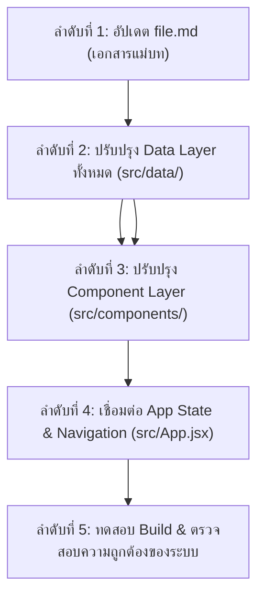

# 📋 Implementation Plan: New Exam Workflow (สอบ 26 ก.ย. 69)

แผนการดำเนินงานปรับปรุงสถาปัตยกรรมและเนื้อหาระบบติวสอบกฎหมายทรัพย์สินทางปัญญา โดยมุ่งเน้นเฉพาะ **3 เสาหลักข้อสอบ (23 มาตราแม่บท)** ตามคำสั่งอาจารย์ผู้สอน และตัดเนื้อหาส่วนเกินที่ไม่เกี่ยวข้องออกทั้งหมด

---

## 📊 สถานะการดำเนินงาน (Work Status Tracker)

### ✅ สิ่งที่ทำไปแล้ว (Completed):
1. **วิเคราะห์ข้อกำหนดและเป้าหมายใหม่ (2 รอบเต็ม)**:
   - ตรวจสอบ [`คำชี้แจงสอบ.txt`](file:///c:/Users/Momo/OneDrive%20-%20Nakhon%20Phanom%20University/app/เตรียมสอบ/กฏหมายลิขสิทธิ%20สอบ%2026-9-69/คำชี้แจงสอบ.txt) และ [`file.md`](file:///c:/Users/Momo/OneDrive%20-%20Nakhon%20Phanom%20University/app/เตรียมสอบ/กฏหมายลิขสิทธิ%20สอบ%2026-9-69/file.md)
   - สรุปขอบเขตข้อสอบเหลือเพียง 3 ข้อ (23 มาตรา) และตัด พ.ร.บ. ลิขสิทธิ์ ออกจากระบบ
2. **ตรวจสอบความถูกต้องทางนิติศาสตร์ (Legal Verification)**:
   - ตรวจพบจุดคลาดเคลื่อนในตารางร่างเดิมของ `file.md` ในส่วนของ ข้อ 2 (ม.56-58, 65 คือสิทธิบัตรการออกแบบผลิตภัณฑ์และบทอนุโลม ไม่ใช่เรื่องละเมิด) และ ข้อ 3 (ม.44 สิทธิแต่ผู้เดียว, ม.46 คดีลวงขาย, ม.61/67 การเพิกถอน)
3. **วางสถาปัตยกรรม New Workflow**:
   - ออกแบบระบบให้หมุนรอบ "3 ข้อสอบจริง" พร้อม 4 มิติการเรียนรู้ (Flashcards, Mind Map, IRAC Drills, Case Study) และแผนติว 7 วัน

---

### ⏳ สิ่งที่เหลืออยู่ (Remaining Tasks) เรียงตามลำดับการทำงาน (Dependency Order):
เราจะทำแบบ **Bottom-Up (จากฐานข้อมูลล่างสุดขึ้นสู่หน้าต่างแสดงผล)** เพื่อป้องกันปัญหาโค้ดพังหรือต้องแก้ซ้ำซ้อน:

---

## 🛠️ รายละเอียดการดำเนินงานทีละขั้นตอน (Sequential Execution Steps)

### ลำดับที่ 1: ปรับแก้เอกสารแม่บท [`file.md`](file:///c:/Users/Momo/OneDrive%20-%20Nakhon%20Phanom%20University/app/เตรียมสอบ/กฏหมายลิขสิทธิ%20สอบ%2026-9-69/file.md)
- [MODIFY] ปรับปรุงตารางมาตรา ข้อ 1, ข้อ 2, ข้อ 3 ให้ถูกต้องตามตัวบทกฎหมายไทย 100%
- บรรจุสูตรช่วยจำ คำสำคัญ และประเด็นข้อสอบตุ๊กตา

### ลำดับที่ 2: ปรับปรุง Data Layer (`src/data/`) ให้สอดคล้องกันทุกไฟล์
1. [MODIFY] [`src/data/patentData.js`](file:///c:/Users/Momo/OneDrive%20-%20Nakhon%20Phanom%20University/app/เตรียมสอบ/กฏหมายลิขสิทธิ%20สอบ%2026-9-69/src/data/patentData.js)
   - ปรับโครงสร้างแยกเป็น 2 หมวดข้อสอบชัดเจน:
     - **ข้อ 1**: สิทธิบัตรการประดิษฐ์ (ม. 5, 6, 7, 8, 28, 31, 35 ทวิ, 36, 54)
     - **ข้อ 2**: สิทธิบัตรการออกแบบผลิตภัณฑ์ & สัญญาจ้าง (ม. 10, 11, 31, 56, 57, 58, 65)
   - ตัดเนื้อหาอนุสิทธิบัตรและมาตรานอกเหนือข้อสอบออก
2. [MODIFY] [`src/data/trademarkData.js`](file:///c:/Users/Momo/OneDrive%20-%20Nakhon%20Phanom%20University/app/เตรียมสอบ/กฏหมายลิขสิทธิ%20สอบ%2026-9-69/src/data/trademarkData.js)
   - ปรับปรุงให้เป็น **ข้อ 3**: เครื่องหมายการค้า เน้นเฉพาะ ม. 6, 7, 8, 13, 44, 46, 61, 67
3. [MODIFY] [`src/data/flashcardsData.js`](file:///c:/Users/Momo/OneDrive%20-%20Nakhon%20Phanom%20University/app/เตรียมสอบ/กฏหมายลิขสิทธิ%20สอบ%2026-9-69/src/data/flashcardsData.js)
   - แยกชุด Flashcards เป็น 3 ชุดตามข้อสอบ: `q1`, `q2`, `q3` รวม 23 ใบการ์ดท่องจำแม่บท
4. [MODIFY] [`src/data/treeData.js`](file:///c:/Users/Momo/OneDrive%20-%20Nakhon%20Phanom%20University/app/เตรียมสอบ/กฏหมายลิขสิทธิ%20สอบ%2026-9-69/src/data/treeData.js)
   - ปรับ Mind Map ให้เป็นแผนภูมิตรรกะการวินิจฉัยข้อสอบ 3 ข้อ
5. [MODIFY] [`src/data/quizData.js`](file:///c:/Users/Momo/OneDrive%20-%20Nakhon%20Phanom%20University/app/เตรียมสอบ/กฏหมายลิขสิทธิ%20สอบ%2026-9-69/src/data/quizData.js)
   - ปรับข้อสอบปรนัยเจาะลึกเฉพาะ 3 ข้อสอบ (ดักทางข้อสอบลวง ม.6 วรรคท้าย, สิทธิลูกจ้าง ม.11, ม.46 ลวงขาย)
6. [MODIFY] [`src/data/examTipsData.js`](file:///c:/Users/Momo/OneDrive%20-%20Nakhon%20Phanom%20University/app/เตรียมสอบ/กฏหมายลิขสิทธิ%20สอบ%2026-9-69/src/data/examTipsData.js)
   - จัดชุดข้อสอบตุ๊กตาแบบเขียนตอบ IRAC สำหรับ ข้อ 1, ข้อ 2, ข้อ 3 พร้อมแนวคำพิพากษาศาลฎีกาตรงจุด
7. [MODIFY] [`src/data/comparisonData.js`](file:///c:/Users/Momo/OneDrive%20-%20Nakhon%20Phanom%20University/app/เตรียมสอบ/กฏหมายลิขสิทธิ%20สอบ%2026-9-69/src/data/comparisonData.js)
   - ปรับตารางเปรียบเทียบจุดตัดสำคัญ: สิทธิบัตรการประดิษฐ์ (ข้อ 1) vs การออกแบบผลิตภัณฑ์ (ข้อ 2) vs เครื่องหมายการค้า (ข้อ 3)

### ลำดับที่ 3: ปรับปรุง Component Layer (`src/components/`)
1. [MODIFY] [`src/components/Sidebar.jsx`](file:///c:/Users/Momo/OneDrive%20-%20Nakhon%20Phanom%20University/app/เตรียมสอบ/กฏหมายลิขสิทธิ%20สอบ%2026-9-69/src/components/Sidebar.jsx)
   - ปรับเมนูนำทางหลักให้เป็น **ข้อ 1 / ข้อ 2 / ข้อ 3** พร้อม Badge เลขมาตรา
   - ปรับเมนูเครื่องมือเสริมให้ตรงกับ 4 มิติ และตารางติว 7 วัน
2. [MODIFY] [`src/components/Navbar.jsx`](file:///c:/Users/Momo/OneDrive%20-%20Nakhon%20Phanom%20University/app/เตรียมสอบ/กฏหมายลิขสิทธิ%20สอบ%2026-9-69/src/components/Navbar.jsx)
   - ปรับระบบค้นหาให้กรองมาตราใน 3 ข้อสอบ และแสดงแถบวัดผลความพร้อมสู่ 26 ก.ย. 69
3. [MODIFY] [`src/components/FlashcardViewer.jsx`](file:///c:/Users/Momo/OneDrive%20-%20Nakhon%20Phanom%20University/app/เตรียมสอบ/กฏหมายลิขสิทธิ%20สอบ%2026-9-69/src/components/FlashcardViewer.jsx) & [`src/components/QuizView.jsx`](file:///c:/Users/Momo/OneDrive%20-%20Nakhon%20Phanom%20University/app/เตรียมสอบ/กฏหมายลิขสิทธิ%20สอบ%2026-9-69/src/components/QuizView.jsx)
   - เพิ่มตัวกรองสลับทำทีละข้อสอบ (ข้อ 1 / ข้อ 2 / ข้อ 3 / ทั้งหมด)
4. [NEW] [`src/components/StudyScheduleView.jsx`](file:///c:/Users/Momo/OneDrive%20-%20Nakhon%20Phanom%20University/app/เตรียมสอบ/กฏหมายลิขสิทธิ%20สอบ%2026-9-69/src/components/StudyScheduleView.jsx)
   - คอมโพเนนต์ตารางติวเข้ม 7 วัน Interactive Checklist เช็คงานประจำวันและคำนวณ Readiness %

### ลำดับที่ 4: เชื่อมต่อและปรับปรุง Application Layer (`src/App.jsx`)
- [MODIFY] [`src/App.jsx`](file:///c:/Users/Momo/OneDrive%20-%20Nakhon%20Phanom%20University/app/เตรียมสอบ/กฏหมายลิขสิทธิ%20สอบ%2026-9-69/src/App.jsx)
  - ปรับ default activeTab เป็น `q1`
  - ปรับ State และ Routing การแสดงผลให้สอดรับกับโครงสร้างข้อมูลใหม่

### ลำดับที่ 5: การตรวจสอบและ Build Validation
- รัน `npm run build` เพื่อตรวจสอบว่าไม่มี Typescript/JSX/Syntax error ใดๆ
- ตรวจสอบการทำงานของ Web Speech API (TTS), Interactive Tabs และ LocalStorage

---

## 🔍 Verification Plan
1. **Data Consistency**: ตรวจสอบว่ามาตราใน 3 ข้อสอบตรงกับ `คำชี้แจงสอบ.txt` (ข้อ 1: 9 มาตรา, ข้อ 2: 7 มาตรา, ข้อ 3: 8 มาตรา)
2. **Build Test**: ทดสอบรัน `npm run build` ตรวจสอบ bundling สำเร็จ 100%
3. **User Flow Test**: ตรวจสอบการคลิกเลือก ข้อ 1, ข้อ 2, ข้อ 3, Flashcards, Mind Map, IRAC Drills และตารางติว 7 วัน
